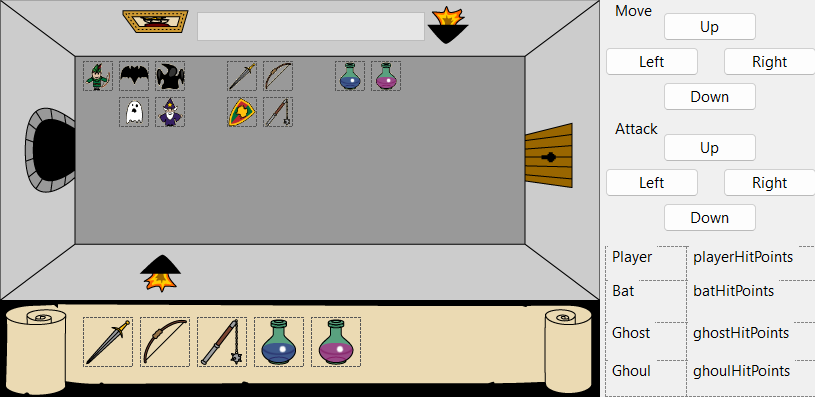
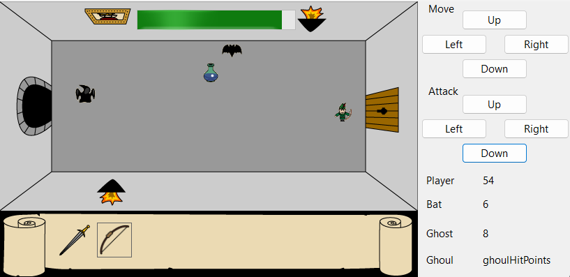
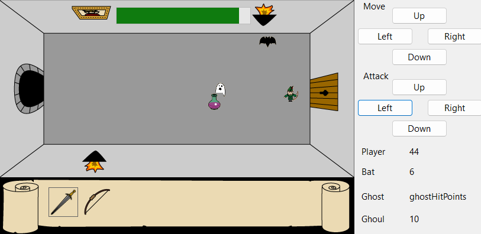

# 🛡️ WinForms Dungeon Quest

A simple 2D dungeon-style game built with Windows Forms (.NET Framework). The player fights random enemies using various weapons and potions, with limited time to complete each level.

---

## 📸 Screenshots

| Layout | Stage 1 | Stage 2 |
|--------|---------|---------|
|  |  |  |

---

## 🎮 Game Description

- The game randomly spawns **enemies** (Bat, Ghost, Ghoul) and **items** (weapons & potions) on each level.
- The player can **move** using the `W`, `A`, `S`, `D` keys or via UI buttons.
- **Attack directions** can also be controlled with buttons on the right side.
- The player must defeat all enemies before the **timer (shown as a progress bar)** runs out.
- If the player dies or the time ends, they are prompted to restart the game.

---

## 🧱 Features

- ✅ Move with `W`, `A`, `S`, `D` or UI buttons
- ✅ Attack in 4 directions (Up, Down, Left, Right)
- ✅ Randomized level layout (enemies + items)
- ✅ Weapons: Sword, Bow, Mace
- ✅ Potions: Blue Potion (Health), Red Potion (Health)
- ✅ Countdown timer (120 seconds by default)
- ✅ Health display for player and each enemy
- ✅ Game Over prompt with Restart option

---

## 🕹️ Controls

### Movement
| Action     | Key | Button UI |
|------------|-----|-----------|
| Move Up    | `W` | ⬆ Up      |
| Move Down  | `S` | ⬇ Down    |
| Move Left  | `A` | ⬅ Left    |
| Move Right | `D` | ➡ Right   |

### Attack
Use the **Attack** buttons on the UI:
- Attack in any direction (Up, Down, Left, Right)

---

## 🧪 Gameplay Mechanics

- Each level starts with random positions for all enemies and items.
- The player collects weapons/potions and defeats enemies by attacking.
- Health points of the player and all enemies are shown on the right side.
- Potions instantly restore health when picked up.
- Timer counts down from 120 seconds. When it hits 0:
  - A message appears asking the player whether to restart the game.

---
